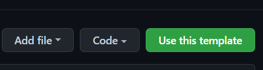
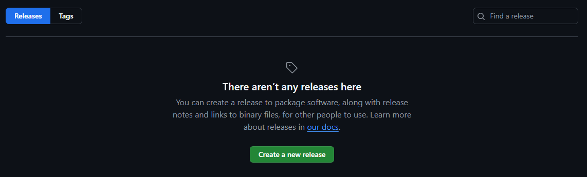
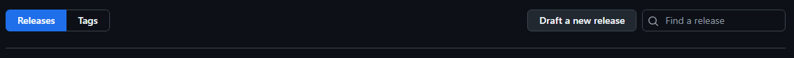
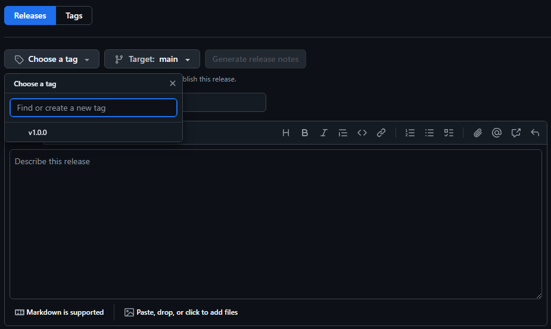
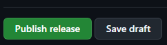

# SFML Project Template

A cross-platform template for C++ SFML projects using CMake

## How to use?

### Clone

There are two ways to use this project template. You can either create your own GitHub repo using this template (very similar to forking) or your can directly clone this repo on your local machine. Here are the steps for both these ways:

1. GitHub repo using template

    - Make sure you are logged into your GitHub account.

    - Click on the "Use this template" button.

        

    - Provide a name for your new repo.

    - Click "Create repository from template".

    - Clone your new repo recursively.

    ```bash
    git clone --recursive <your-repo-link-here>
    ```

2. Local repo by direcly cloning

    - Clone this repo recursively using this command:

    ```bash
    git clone --recursive https://github.com/ufrshubham/sfml-project-template.git
    ```

**Note:** If you've already cloned this repo without using `--recursive` flag, just run `git submodule update --init` to update the submodules.

### Code

- Source files should be placed under `src` directory.

- Header files should be placed under `include` directory. Header `Version.hpp` can be removed completely as it is just for demo.

- Source code for SFML is pulled as a submodule under `vendors/sfml` and is built along with your code.

- Assets like images, audio and fonts can be placed under `resources` directory. If you choose to use a custom directory for this, you'll have to handle how your executable finds those assets. The demo code in `src/main.cpp` programitically changes the working directory to the path where `resources` directory is located (see function `modifyCurrentWorkingDirectory()`).

### Build

- Make a directory for build in your project root.

    ```bash
    cmake -E make_directory ./build
    ```

- Go to the build directory.

    ```bash
    cd build/
    ```

- Generate project files (For debug builds, replace `Release` with `Debug`).

    ```bash
    cmake .. -DCMAKE_BUILD_TYPE=Release
    ```

- Build (For debug builds, replace `Release` with `Debug`).

    ```bash
    cmake --build . --config Release
    ```

- The executables will be available in build/bin.

### GitHub Workflow (Build and Release)

This project includes an automated GitHub Actions workflow for building and releasing your application across multiple platforms (Windows, macOS, and Linux).

#### Build Trigger

- To trigger the build workflow, push a version tag to the repository (e.g., v1.0.0), after pushing your recent code changes.

    ```bash
    git tag v1.0.0
    git push origin v1.0.0
    ```

    **Note:** The build workflow will not run again if the same tag is pushed multiple times. To retrigger the workflow, you must delete the existing tag locally and on the remote, then recreate and push it.

    ```bash
    git tag -d v1.0.0
    git push origin --delete v1.0.0

    git tag v1.0.0
    git push origin v1.0.0
    ```

#### Release Trigger

- To publish a release, go to the Releases tab and select either "Create a new release" or "Draft a new release" (depending on whether releases exist).

    

    

- Select a version tag by clicking "Choose a tag".

    

    **Note:** Ensure the tag is created and pushed beforehand.. 

- Click "Publish release".

    

    (This action will trigger the build workflow again, once it is completed, the release workflow will begin. Upon successful completion, the build files for all platforms along with the source code will be uploaded.)

    

## License

This project is released under MIT license. See [LICENSE.md](LICENSE.md) for details. Note that this does not cover any of the submodules located under [vendor](vendors/) and assets located under [resources](resources/).

- [sfml](vendors/sfml/) is covered under [Zlib](vendors/sfml/license.md) license.

- [FiraCode-Regular.ttf](resourcs/FiraCode-Regular.ttf) is covered under [OFL-1.1](https://github.com/tonsky/FiraCode/blob/master/LICENSE) license.